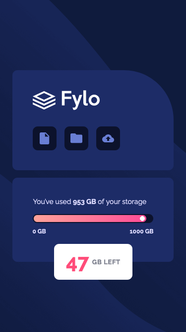
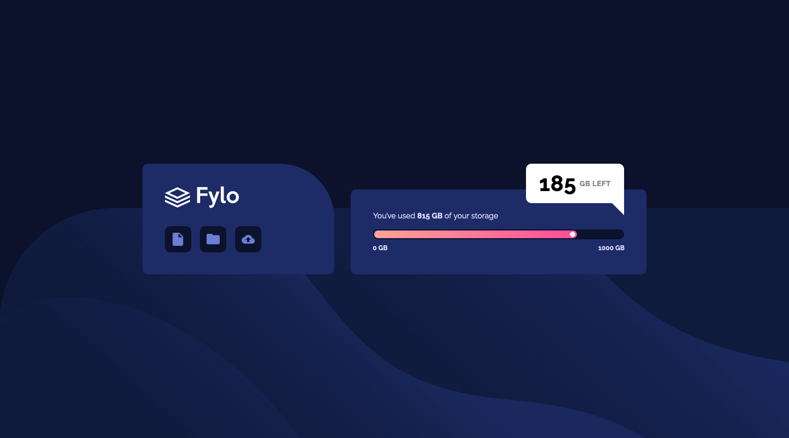

# Frontend Mentor - Fylo Data Storage Component solution

This is a solution to the [Fylo Data Storage Component challenge on Frontend Mentor](https://www.frontendmentor.io/challenges/fylo-data-storage-component-1dZPRbV5n). Frontend Mentor challenges help you improve your coding skills by building realistic projects. 

## The challenge

Users should be able to:

- View the optimal layout for the site depending on their device's screen size

## Screenshot

### Mobile

### Desktop

## Built with

- Semantic HTML5 markup
- CSS custom properties
- Flexbox
- Mobile-first workflow
- JavaScript

## What I learned

To be honest, this wasn't the most difficult challenge I have attempted but it was a lot of fun. I think I managed to make my code very concise yet maintainable and I am pleased with the way I have structured the CSS in particular.

I tried out the `aspect-ratio` property for the first time. This allowed me to create square-shaped elements, and the size of the squares can be adjusted by only changing the `width` property (rather than having to change both `width` and `height` properties together).

## Continued development

I find with larger projects my code can sometimes become messy and bloated. Therefore I want to try some larger projects and see if I can keep the code minimal and well-structured, as I did with this smaller project.